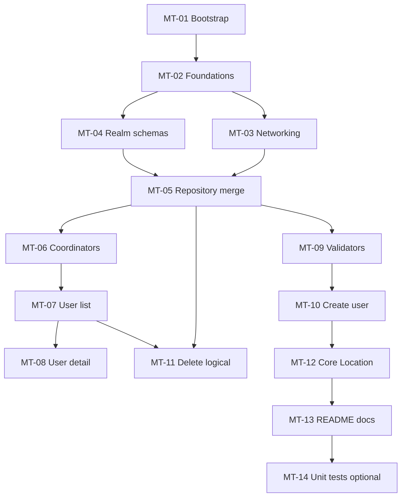

# Plan de desarrollo userflow (tickets MT-XX + Git)

Copia oficial del plan en el repositorio. Mantener este archivo actualizado cuando cambien alcance, APIs o orden de trabajo.

## Premisa (manual, antes de ejecutar MT-01)

En **Xcode**, el desarrollador incorpora **antes** de iniciar el trabajo de tickets:

- Dependencia Swift Package **[realm-swift](https://github.com/realm/realm-swift)** — productos típicos **`Realm`** y **`RealmSwift`** enlazados al target de la app.
- Dependencia Swift Package **Alamofire** — producto enlazado al target.

**`Package.resolved`** (y referencias en `project.pbxproj`) suelen versionarse en Git. Los tickets **MT-01** y **MT-02** **no** incluyen “añadir el paquete por primera vez”; asumen que ya está hecho y se centran en **verificación**, **iOS 15**, **`.gitignore`** y **estructura/i18n**.

## Alcance técnico (resumen)

- **API**: Lista desde [JSONPlaceholder users](https://jsonplaceholder.typicode.com/users); el “delete” contra API será una **simulación** (petición Alamofire) y la **lista visible** debe excluir usuarios dados de baja vía **borrado lógico local** en Realm al fusionar con la respuesta remota (los IDs que vuelvan de la API no se muestran si están marcados como eliminados localmente).
- **Persistencia**: Realm para usuarios locales, cambios desde detalle/edición/alta/borrado lógico; merge explícito en capa repository.
- **Prioridad funcional:** el **100% del enunciado técnico** (lista/detalle crear/editar/eliminar/API/Realm/validadores/async-await/iOS 15+/i18n/Core Location…) es obligatorio y **antecede** a cualquier propuesta solo visual. Todo lo mencionado bajo § *Referencia visual* sirve únicamente para **acomodar esa lógica** en pantallas coherentes (**parecidas**, no clones de un mock), **sin** relajar datos, rutas ni reglas negocio.
- **UI (solo presentación):** SwiftUI; **MVVM** + **Coordinator**. Raíz UX: una **lista principal** de usuarios (**GET `/users` + merge Realm**); **sin tabs**. Detalle, alta y el resto vía push/sheet/modal según enunciado. Estilo **similar** —no igual— al mock en § *Referencia visual*; sin marca/texto de demos ajenos.
- **Concurrencia**: **async/await** en ViewModels/servicios (cumple la alternativa Combine/async del enunciado). **No** usar Combine como capa principal; ver nota de compatibilidad abajo. Evitar GCD salvo wrappers puntuales si alguna librería lo exige.
- **iOS**: despliegue **15+**; en **MT-01** se fija/verifica el target (coincide con requisito). **Realm y Alamofire** se dan de alta **manualmente por SPM** antes de MT-01 (véase *Premisa* arriba).
- **i18n**: String Catalog (`Localizable.xcstrings` o equivalente del proyecto) con **es/en** (desde **MT-02** Foundations).
- **Core Location**: **When In Use** + obtención de coordenadas **al pulsar el botón** en Creación; **popup**/sheet con latitud/longitud; **sin** modo background/`UIBackgroundModes` de ubicación. En README se justifica por enfoque de producto/revisión de App Store vs. texto literal del PDF (la funcionalidad pedida encaja en primer plano).

### async/await frente a Combine (iOS 15)

- **Decisión del equipo:** priorizar **Swift Concurrency** (`async`/`await`, `Task`, `@MainActor`, `async let` donde aplique), no Combine, salvo integración puntual con una API que solo exponga publishers.
- **Compatibilidad con iOS 15:** el modelo de concurrencia estructurada de Swift está **disponible desde iOS 15** junto con **Swift 5.5+** (Xcode 13 en adelante). No sube el mínimo de despliegue respecto al requisito del enunciado.
- **Red con Alamofire:** exponer métodos `async throws` desde el cliente (wrappers con **`withCheckedThrowingContinuation`** sobre callbacks si hace falta) o usar extensiones Alamofire que ya ofrezcan `async` cuando coincidan con la versión del paquete.

### Referencia visual (lista y detalle — inspiración, no copia literal)

- **Solo UX:** estas reglas aplican únicamente a **presentación** (layouts, espaciado, **jerarquía tipográfica**, colores alineados con el sistema). Las **historias funcionales vienen sólo del enunciado oficial** y de los tickets MT; ante cualquier duda menor, prima el **requisito técnico**.
- **Navegación:** **Sin tabs** y **sin barra inferior de pestañas.** La entrada natural de la app es **una pantalla única de listado** con los usuarios obtenidos de **GET `/users`** (y vistas derivadas tras merge Realm). Las demás pantallas del enunciado (detalle, crear…) se abren **encima** cuando corresponda, sin convertir esa lista en uno de dos “pasos tipo tab”.
- **Fondo tipo grouped**, tarjetas blancas redondeadas, cabecera con título, **búsqueda** local con **`.searchable`** (iOS 15+) sobre los usuarios mostrados, botón opcional de orden/filtro trivial en toolbar.
- **Títulos (ES/EN):** **“User Flow”**, **“Usuarios”**, **“Users”**; **no** “Candidates” ni otros textos del mock literal.
- **Contenido de tarjeta:** mostrar datos reales del requisito: **nombre**, **username**, **teléfono**, **email**, **ciudad**; jerarquía tipográfica (título destacado + líneas secundarias); avatar por recurso por defecto. Acciones rápidas (iconos teléfono / correo) opcionales vía deep links solo si hay dato válido.
- **Detalle:** mismo lenguaje visual (hero avatar, agrupaciones legibles); edición nombre/email dentro de ese estilo.

### Mapa de cobertura (requisitos del enunciado)

- **Stack (Swift, MVVM+C, SwiftUI, Realm, Alamofire, errores, iOS 15+, ES/EN)**: **Premisa SPM manual** + **MT-01**–**MT-06**, **MT-13**.
- **Lista usuarios + API**: **MT-03**, **MT-07** (presentación desde merge/caché vía **MT-05**).
- **Detalle completo + imagen perfil por defecto + editar nombre/email local**: **MT-08**.
- **Alta formulario local + lista actualizada**: **MT-10** (**MT-09** validaciones).
- **Eliminar API simulación + Realm + lista sin usuario (borrado lógico)**: **MT-11**.
- **Funciones validación reutilizables**: **MT-09**.
- **Combine o async/await**: **async/await** de forma nominal (véase apartado *async/await frente a Combine* arriba).
- **Ubicación (permisos, lat/long, botón en creación, popup)**: **MT-12** (**When In Use** por decisión acordada; README documenta alcance vs. texto “segundo plano”).
- **UI inspirada mock**: **MT-07** (lista principal JSON/Realm sin tabs); **MT-08** detalle mismo lenguaje — **similar, no igual** al mock (*Referencia visual*).
- **Criterios de evaluación y entrega (README, Git público)**: **MT-13** + flujo de ramas descrito; **MT-14** cubre tests opcionales.

## Flujo Git y commits

- Rama base continua: `develop`.
- Por ticket **MT-NN**: crear `feature/MT-NN-<short-slug>` (ej. `feature/MT-07-user-list`).
- Implementar con **commits atómicos** en **inglés** (presente imperativo, una intención por commit).
- Al cerrar ticket: merge hacia **`develop`** antes del siguiente ticket.
- Orden recomendado de merges: tabla y sección orden operativa más abajo.

### Build binario por ticket (**`CFBundleVersion`**)

- Cada ticket **MT-NN** que se fusiona lleva **un solo** número de build, correlativo dentro de la versión de marketing (no dos tickets distintos con el mismo **`N`**).
- **Al dar el ticket por completo** (antes del merge a `develop`): añadir en **`CHANGELOG.md`** la sección **`### Build N — MT-NN …`** y actualizar **`CURRENT_PROJECT_VERSION`** en el proyecto Xcode al mismo **`N`** (Debug y Release).
- Si varias ramas quedaron con el mismo build en paralelo, al integrar tras `develop` hay que **reconciliar**: dejar una secuencia única (p. ej. el último mergeado sube **`N`** y la rama que queda retrabaja changelog + proyecto).

## Artefactos de documentación

- **[README](../README.md)** (raíz): documentación consolidada (**MT-13**) — alcance obligatorio ↔ implementación, arquitectura (MVVM+C), SPM/ejecución, merge **`isDeleted`**, validación (**MT-09**), ubicación (**MT-12 When In Use**), `CHANGELOG`/versión y enlaces Git.
- **Este archivo** [`docs/development-plan.md`](./development-plan.md): tabla Jira/interna, dependencias y DoD por ticket para el equipo.

## Dependencias entre bloques



## Listado de tickets Jira `MT-XX`

| Ticket | Título | Contenido / Criterios de aceptación |
|--------|--------|-------------------------------------|
| **MT-01** | Bootstrap: `.gitignore`, iOS 15 mínimo, verificar SPM Realm | **`IPHONEOS_DEPLOYMENT_TARGET` = 15** (proyecto + target); **`.gitignore`** en raíz (Xcode / Swift / SwiftPM). **Comprobar** que **[realm-swift](https://github.com/realm/realm-swift)** ya añadido **manualmente** resuelva y compile (`import RealmSwift`). *No incluye primera incorporación del paquete* (véase premisa). |
| **MT-02** | Foundations: estructura, verificar Alamofire, i18n base | Carpetas (`Core`, `Features/Users`, `Coordinators`, `Resources`); **comprobar** SPM **Alamofire** ya enlazado **manualmente** al target; String Catalog **ES/EN**; errores/tipos compartidos placeholder. Sin lógica de usuarios. *No incluye alta inicial del paquete Alamofire.* |
| **MT-03** | Networking JSONPlaceholder + errores | `GET /users`; modelos Codable acordes a la API; capa Alamofire; mapeo a errores legibles; **async-await** donde sea viable. |
| **MT-04** | Modelos Realm y borrado lógico | `UserObject` en Realm con campos para UI + borrado lógico; usuarios solo-locales diferenciados; helpers de escritura/lectura; migración inicial. |
| **MT-05** | Repository merge: API + Realm + filtros | Cache tras GET; merge con exclusiones por borrado lógico; crear/editar local reflejado en lista. |
| **MT-06** | Coordinators (MVVM + C) | Navegación lista → detalle y flujo crear usuario; inyección ligera. |
| **MT-07** | Lista principal de usuarios (JSON/API + Realm) | **Pantalla raíz única** de usuarios (GET `/users` + merge Realm), **sin tabs**: tarjetas, `.searchable`, toolbar opcional; títulos **User Flow / Usuarios / Users** (nunca “Candidates”); estilo **inspirado** en mock compartido, **no replica exacta**. Crear usuario vía botón **+** o equivalente (Coordinator); tap → **MT-08**. async/await. |
| **MT-08** | Pantalla Detalle | Mismos criterios de **inspiración visual** (*similar, no clon*) que MT-07. Campos completos del modelo; hero avatar recurso por defecto; editar nombre/email en Realm (enunciado). |
| **MT-09** | Validaciones reutilizables | Email, non-empty, teléfono; reutilizables en Creación (y detalle si aplica). |
| **MT-10** | Alta de usuario (formulario local) | Formulario + MT-09; persistir; lista actualizada vía MT-05. |
| **MT-11** | Eliminar: simulación API + persistencia + lista | `DELETE` Alamofire cuando haya `apiId` remoto; borrado lógico; filtro en merge. |
| **MT-12** | Core Location When In Use + botón crear | Permisos, lat/lon en popup desde pantalla Creación. |
| **MT-13** | README + plan en repo | README exhaustivo; revisar `docs/development-plan.md` si el código diverge del diseño. |
| **MT-14** *(opcional)* | Pruebas unitarias | Validators, merge, mocks HTTP; target de test. |

---

## Detalle técnico: API y modelo de datos

### JSONPlaceholder (`https://jsonplaceholder.typicode.com`)

- **Lista**: `GET /users` — arreglo con `id`, `name`, `username`, `email`, `phone`, `website`, `address` (nested: `street`, `suite`, `city`, `zipcode`, `geo`), `company` (nested). La lista debe proyectar **`address.city`** (no solo “ciudad” suelta).
- **Eliminar (simulado)**: `DELETE /users/:id` — la API suele responder **HTTP 200** con `{}` sin persistencia real; aun así la app debe ejecutar Alamofire y tratar errores **de red**/timeout.
- **Implicancia**: Tras cualquier nuevo `GET /users`, los usuarios “eliminados” **siguen llegando**. La exclusión solo puede cumplirse con **fusión contra Realm** usando **flag de borrado lógico** por `apiId`.

### Persistencia Realm (conceptual)

| Concepto | Intención |
|----------|-----------|
| **Identidad remota** | `Int` igual a `User.id` de JSONPlaceholder donde aplique |
| **Usuarios locales puros** | Identificador local estable (ej. UUID string) fuera del rango de la API **o** `apiId == 0` con flag “solo local”; no llamar `DELETE` remoto hasta que exista `apiId > 0` si la política lo exige |
| **`isDeleted` / tombstone** | Marcar tras “eliminar”; el merge **omitirá** ese `apiId` al armar lista para UI |
| **Overrides locales** | Nombre/email editados sobrescriben lo mostrado aun cuando el siguiente GET traiga otros valores hasta que se redefine la política (documentar en README: “truth local tras edición”) |

---

## Política de merge (lista mostrada — para MT-05 y README)

Pasos recomendados al obtener lista para UI (o tras refresh):

1. **GET** usuarios desde red; ante fallo opcionalmente mostrar última foto **cacheada en Realm** y mensaje de error (cumple **caché + errores** del enunciado).
2. **Upsert en Realm**: actualizar registros conocidos por `apiId`; no borrar físicamente filas marcadas borradas desde **GET** solo por no venir — el GET es la lista maestra de “existentes remotos”; la exclusión viene del **filtro**.
3. **Construir modelo de vista** por unión Realm: orden por nombre o por `apiId`; **excluir** todos con `isDeleted == true`; aplicar `_displayName` / `_displayEmail` si persisten edits locales sobre `name` / `email` del DTO persistido.

Documentar estos pasos textualmente en README vía **MT-13**.

**Estado (MT-13):** la política aplicada en código y cómo se refleja en la UI está descrita en **[README.md](../README.md)** (secciones **Política de merge y pantalla lista** y **Estado del alcance obligatorio**).

---

## Estructura de carpetas sugerida (MVVM+C)

Colocación orientativa (ajústala en **MT-02** al estilo Xcode File System Groups si usas synced folder):

```
userflow/
  App/
  Coordinators/
  Features/
    Users/
      List/
      Detail/
      Create/
  Core/
    Networking/
    Persistence/
    Validation/
    Location/
```

Regla: Views delgadas — **solo** estado + llamadas simples al VM/coordinator; lógica y async en **ViewModel**.

---

## Responsabilidades MVVM+C (evitar “Massive Coordinator”)

| Capa | Rol |
|------|-----|
| **Coordinator** | Construir VMs con dependencias, disparar rutas (`push`/`sheet`), exponer closures mínimos; **sin** Alamofire/Realm dentro de las Views |
| **ViewModel** (`@MainActor`) | Estados `idle/loading/error/loaded`, validación de intents, llama protocols `UserRepository`/API/async |
| **Repository** | Único lugar que compone red + Realm + política merge |
| **View** | Binding SwiftUI + accesibilidad básica; strings localizados |

---

## i18n (ES/EN)

- Usar **String Catalog**: claves establecidas desde **MT-02** (las pantallas añaden claves incrementalmente por ticket UI).
- Mínimos: errores genéricos de red/tiempo indefinido, botones Cancelar/Aceptar, títulos de pantalla, placeholders de formulario, textos del popup de ubicación, **Usage Description** equivalente donde aplique (`Info.plist` / build settings locales).

---

## Orden recomendado de merges (lista operativa para Jira/epic)

1. **MT-01** (bootstrap: gitignore + iOS 15 + verificación Realm SPM manual).
2. **MT-02** (estructura + verificación Alamofire manual + catálogo strings) → luego **MT-03** y **MT-04** pueden ir en paralelo desde `develop` si conviene; antes de **MT-05** ambas integradas.
3. **MT-05**
4. **MT-06**
5. **MT-07**
6. **MT-08**
7. **MT-09** (opcional paralelo tras MT-05; merge práctico tras MT-06)
8. **MT-10**
9. **MT-11**
10. **MT-12**
11. **MT-13**
12. **MT-14** (opcional)

---

## Elaboración por ticket (DoD compacto)

### MT-01 — Bootstrap

**Entregables:** `.gitignore` en raíz; **`IPHONEOS_DEPLOYMENT_TARGET` = 15**; build verde verificando que **RealmSwift** (SPM ya añadido **manualmente** por el equipo) compila.

**Commits sugeridos:** `Add Swift iOS Xcode gitignore` · `Set minimum deployment target to iOS 15` · opcionalmente `Commit Package.resolved` si el equipo versiona cambios SPM hechos antes del ticket.

### MT-02 — Foundations

**Entregables:** carpetas/group; confirmar que **Alamofire** (SPM **manual**) está enlazado al target; String Catalog ES+EN; placeholders `AppError`; compila.

**Commits sugeridos:** `Introduce Core folder scaffolding` · `Add base Localizable string catalog`

### MT-03 — Networking

**Entregables:** cliente JSONPlaceholder; DTOs; `fetchUsers()`, `deleteUser(id:)` async; errores tipados.

### MT-04 — Realm schemas

**Entregables:** `UserObject`; `apiId`; `isDeleted`; migración `schemaVersion`.

### MT-05 — Repository merge

Orquestación red + Realm + política de lista; sin reactivar `isDeleted` en upsert inadvertido.

### MT-06 — Coordinators

Navegación SwiftUI **válida iOS 15** (`NavigationView` + identidad/programático si aplica); documentar en README si se adopta opción solo iOS 16+ más adelante.

**Commits sugeridos:** `Introduce UsersFlowCoordinator wiring` · `Inject repository into coordinators`

### MT-07 — Lista

**Pantalla principal** tras abrir la app: usuarios desde JSON/API/cache Realm; **sin tabs**. Cinco datos por tarjeta; `.searchable`; estilo **parecido** al mock (**no igual**); **+** crear usuario; refresco opcional.

### MT-08 — Detalle

Misma línea estética (**inspiración, no copia**); avatar recurso por defecto; edición nombre/email en Realm.

### MT-09 — Validadores

Funciones puras reutilizables.

### MT-10 — Alta

Formulario + MT-09 + lista actualizada.

### MT-11 — Eliminar

UI + DELETE simulado + `isDeleted` + filtro.

### MT-12 — Core Location

When In Use; botón en creación; popup coords; plist localizado.

### MT-13 — Documentación

README + coherencia de `docs/development-plan.md`. Opcional: guardar PNG de inspiración visual en **`docs/design/`** (referencia solo interna para el equipo).

### MT-14 — Tests (opcional)

Target tests; mocks y merges.

---

## Convenios Jira/Git

| Elemento | Formato ejemplo |
|----------|-----------------|
| Rama | `feature/MT-01-bootstrap-ios15-gitignore` |
| Commit | `chore(project): add gitignore for Xcode and Swift PM` |
| PR title | `[MT-01] Add gitignore, set iOS 15 minimum, verify Realm SPM` |
| Build al cerrar ticket | Un **solo** **`N`** por **MT-NN**: `CHANGELOG.md` **`### Build N`** + proyecto **`CURRENT_PROJECT_VERSION = N`** antes del merge a `develop` |

---

## Riesgos / notas rápidas

- **Xcode SDK vs iOS 15:** deployment puede ser 15 usando APIs disponibles desde 15 sin `NavigationStack` salvo aumentar mínimo con decisión explícita.
- **Realm + concurrencia:** respetar hilo/contexto de lectura de objetos; ViewModels `@MainActor` donde aplique.

## Próximo paso operativo

Crear la rama `feature/MT-01-...` desde `develop` después de haber completado la **premisa SPM manual** (Realm + Alamofire), implementar **MT-01**, merge a `develop`, y seguir la secuencia arriba.
